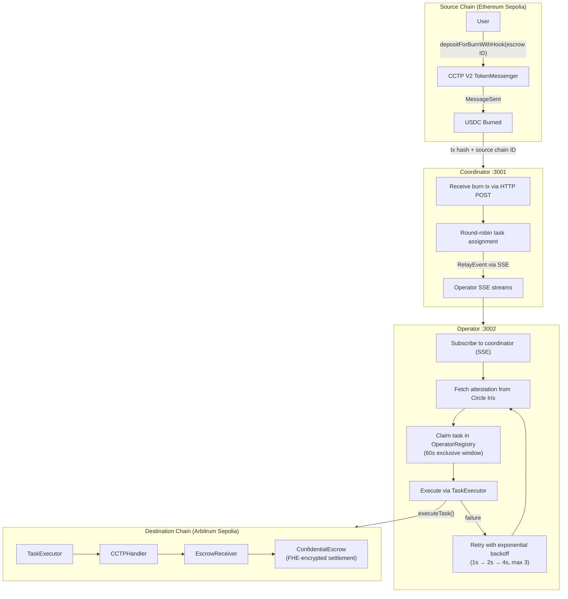

# ReineiraOS — Operator Infrastructure

> Off-chain agents, relayers, and coordinators that power ReineiraOS programmable stablecoin operations.

Built on Arbitrum Sepolia. Relay via Circle CCTP V2. Settlement into FHE-encrypted escrow via Fhenix.

---

## What This Repo Does

ReineiraOS is programmable infrastructure for stablecoins — confidential escrow, conditional payments, agentic automation. This monorepo contains the **off-chain operator layer** that makes it work: the services that watch for cross-chain events, relay messages, claim tasks, execute settlement, and earn fees.

Operators are the execution backbone. They stake GOV tokens, subscribe to a coordinator for task assignments, fetch Circle attestations, and execute relay transactions on the destination chain — triggering escrow settlement, fund release, and other on-chain actions.

---

## Architecture



---

## Packages

| Package                     | What It Does                                                                                                                                                                          |
| --------------------------- | ------------------------------------------------------------------------------------------------------------------------------------------------------------------------------------- |
| `@reineira-os/operator`     | Automated relay agent. Subscribes to coordinator, fetches attestations, claims and executes tasks on-chain. NestJS service with retry logic, nonce management, and health monitoring. |
| `@reineira-os/coordinator`  | Task distribution service. Receives CCTP burn notifications, maintains SSE streams to operators, assigns tasks round-robin.                                                           |
| `@reineira-os/operator-cli` | CLI for operator lifecycle and manual operations — register, stake, bridge USDC, relay messages, create FHE-encrypted escrows.                                                        |
| `@reineira-os/shared`       | Shared types (`OperatorInfo`, `TaskClaim`, `CCTPPayload`), task type hashes, timing constants, and contract addresses.                                                                |

---

## End-to-End Flow

1. **User** creates an FHE-encrypted escrow and bridges USDC via CCTP V2 with the escrow ID as hook data
2. **Coordinator** receives the burn tx notification and distributes a `RelayEvent` to the next available operator via SSE
3. **Operator** picks up the job, polls Circle Iris for the attestation, claims the task on-chain (60s exclusive window), and executes via `TaskExecutor`
4. **On-chain contracts** receive the CCTP message + attestation, mint USDC on destination, and route funds into the confidential escrow for settlement

If execution fails due to a transient error (network, timeout), the operator retries with exponential backoff (1s → 2s → 4s, up to 3 attempts). Permanent failures (already executed, insufficient stake) are not retried.

---

## Quick Start

**Prerequisites:** Node.js 18+, npm 9+, Sepolia testnet RPC access

```bash
npm install
npm run build
cp .env.example .env
```

### Run the Coordinator

```bash
npm run start -w @reineira-os/coordinator
# Listens on port 3001
```

### Run an Operator

```bash
npm run start -w @reineira-os/operator
# Connects to coordinator, listens on port 3002
```

---

## Operator CLI

### Environment

```bash
export RPC_URL=https://arbitrum-sepolia-rpc.publicnode.com
export RPC_URL_SOURCE=https://ethereum-sepolia-rpc.publicnode.com
export PRIVATE_KEY=0x...
export OPERATOR_REGISTRY_ADDRESS=0x5Ac3a3750e0a9f7d4ddBC0B52c3f13E8f927FB59
export TASK_EXECUTOR_ADDRESS=0x4D239335f39E585Bb75631C4683538EFC496a5EB
```

### Commands

```bash
# Operator lifecycle
npx reineira-operator register --stake 5000   # Register with minimum 5000 GOV
npx reineira-operator status                  # Check operator status
npx reineira-operator stake info              # View stake details
npx reineira-operator stake add --amount 1000 # Add stake
npx reineira-operator unbond                  # Start 7-day unbonding
npx reineira-operator withdraw                # Withdraw after unbond

# Bridge USDC via CCTP V2
npx reineira-operator bridge --amount 100 --escrow-id 1 --fast

# Manual relay execution
npx reineira-operator relay --tx-hash 0x...

# Create FHE-encrypted escrow
npx reineira-operator create-escrow --amount 100 --owner 0x... --resolver 0x...
```

| Option                 | Env Variable                | Description                              |
| ---------------------- | --------------------------- | ---------------------------------------- |
| `--rpc <url>`          | `RPC_URL`                   | Destination chain RPC (Arbitrum Sepolia) |
| `--private-key <key>`  | `PRIVATE_KEY`               | Operator wallet private key              |
| `--registry <address>` | `OPERATOR_REGISTRY_ADDRESS` | OperatorRegistry contract                |

---

## Operator Economics

| Parameter            | Value       |
| -------------------- | ----------- |
| Minimum Stake        | 5,000 GOV   |
| Exclusive Window     | 60 seconds  |
| Permissionless Delay | 600 seconds |
| Operator Fee         | 0.5%        |
| Protocol Fee         | 0.3%        |
| Unbond Period        | 7 days      |

Operators stake GOV tokens to register. When assigned a task, they have a 60-second exclusive window to execute. After 600 seconds, anyone can execute the task permissionlessly. Operators earn 0.5% of relayed volume as fees.

---

## Deployed Contracts (Arbitrum Sepolia)

| Contract                         | Address                                      |
| -------------------------------- | -------------------------------------------- |
| OperatorRegistry                 | `0x5Ac3a3750e0a9f7d4ddBC0B52c3f13E8f927FB59` |
| TaskExecutor                     | `0x4D239335f39E585Bb75631C4683538EFC496a5EB` |
| FeeManager                       | `0x639f5cB99DcF9681A0461A1452c3845811d3308A` |
| CCTPHandler                      | `0x575186a64B9FC49E135A2440DC4A1395edc0F3aD` |
| Staking Token (GOV)              | `0xb847e041bB3bC78C3CD951286AbCa28593739D12` |
| CCTPV2ConfidentialEscrowReceiver | `0xe0E6CC9Ee62Fa36b96eC4F50CDc462Fd14aa0fD3` |
| ConfidentialEscrow               | `0xF50A9CF008a79CFCA39aa9a345aa06e8D12727E2` |

---

## Task Types

| Task         | Hash          | Description                          |
| ------------ | ------------- | ------------------------------------ |
| `CCTP_RELAY` | `0x7f5909...` | Cross-chain USDC relay via CCTP V2   |
| `AUTOMATION` | —             | Scheduled and conditional automation |
| `AGENT_CALL` | —             | Autonomous agent execution           |

---

## Key Design Decisions

- **SSE over polling** — Coordinator pushes events to operators via Server-Sent Events, one Subject per operator. Automatic reconnection with up to 10 attempts.
- **Exponential backoff** — Retryable errors (network, timeouts) trigger up to 3 retries at 1s, 2s, 4s intervals. Permanent failures (already executed, business logic) fail immediately.
- **Nonce mutex** — Serializes write transactions with a fresh `getTransactionCount('pending')` call per TX, preventing nonce collisions from both concurrent operator tasks and external wallet usage (e.g. CLI).
- **Job state machine** — Each relay job tracks 7 states: `pending → fetching_attestation → claiming → executing → completed | failed | pending_retry`.
- **In-memory storage** — Coordinator uses in-memory message repository (production will use PostgreSQL/Redis).

---

## Development

```bash
npm run lint
npm run format
npm run build -w @reineira-os/operator-cli
```

## Related Repositories

- [@reineira-os/orchestration](../orchestration) — Operator registry, task executor, and fee management contracts
- [@reineira-os/escrow](../escrow) — FHE-encrypted confidential escrow contracts

## License

Apache-2.0
