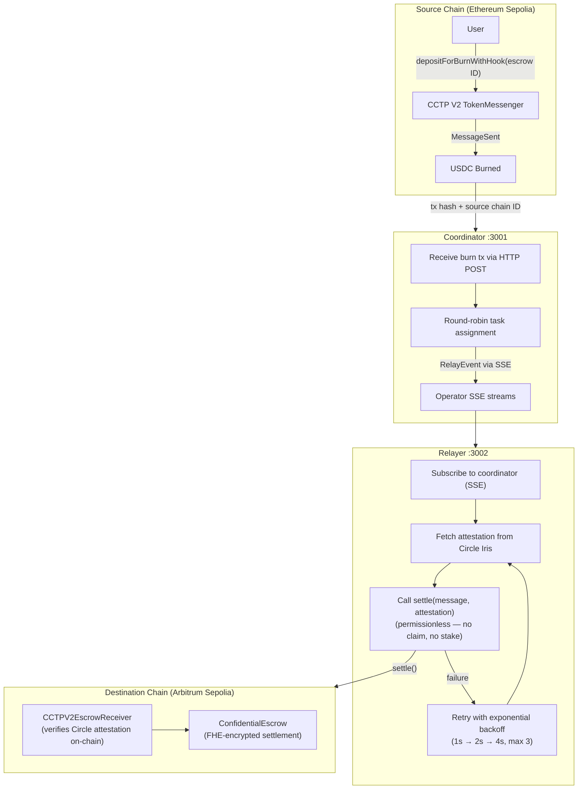

# ReineiraOS — Operator Infrastructure

> Off-chain agents, relayers, and coordinators that power ReineiraOS programmable stablecoin operations.

Built on Arbitrum Sepolia. Relay via Circle CCTP V2. Settlement into FHE-encrypted escrow via Fhenix.

---

## What This Repo Does

ReineiraOS is programmable infrastructure for stablecoins — confidential escrow, conditional payments, agentic automation. This monorepo contains the **off-chain relayer layer** that makes it work: the services that watch for cross-chain events, fetch Circle attestations, and settle messages into escrow.

Relayers are the liveness backbone — they are **permissionless and stateless**. There is no registration, no staking, and no fees. A relayer subscribes to a coordinator for burn notifications, fetches the Circle attestation, and calls `CCTPV2EscrowReceiver.settle(message, attestation)` on the destination chain. Settlement safety comes from the Circle attestation (verified on-chain); the relayer only affects how quickly a settlement lands, and anyone can settle a pending message if a relayer is down.

---

## Architecture



---

## Packages

| Package                     | What It Does                                                                                                                                                                                               |
| --------------------------- | ---------------------------------------------------------------------------------------------------------------------------------------------------------------------------------------------------------- |
| `@reineira-os/operator`     | Automated relayer. Subscribes to coordinator, fetches attestations, and settles messages on-chain via permissionless `settle()`. NestJS service with retry logic, nonce management, and health monitoring. |
| `@reineira-os/coordinator`  | Burn-notification inbox. Receives CCTP burn notifications, maintains SSE streams to relayers, round-robins to avoid duplicate gas.                                                                         |
| `@reineira-os/operator-cli` | Development, debugging & deployment CLI — bridge USDC, settle (relay) messages, create/redeem FHE-encrypted escrows.                                                                                       |
| `@reineira-os/shared`       | Shared types (`CCTPPayload`, `RelayMetadata`), task type hashes, and contract addresses.                                                                                                                   |

---

## End-to-End Flow

1. **User** creates an FHE-encrypted escrow and bridges USDC via CCTP V2 with the escrow ID as hook data
2. **Coordinator** receives the burn tx notification and distributes a `RelayEvent` to a subscribed relayer via SSE
3. **Relayer** picks up the job, polls Circle Iris for the attestation, and calls `CCTPV2EscrowReceiver.settle(message, attestation)` — permissionless, no claim, no stake
4. **Receiver** verifies the Circle attestation on-chain, mints USDC on destination, and routes funds into the confidential escrow for settlement

If settlement fails due to a transient error (network, timeout), the relayer retries with exponential backoff (1s → 2s → 4s, up to 3 attempts). Permanent failures (already received, already settled) are not retried.

---

## Quick Start

**Prerequisites:** Node.js 18+, npm 9+, Sepolia testnet RPC access

```bash
npm install
npm run build
cp .env.example .env
```

### Run the Coordinator

```bash
npm run start -w @reineira-os/coordinator
# Listens on port 3001
```

### Run an Operator

```bash
npm run start -w @reineira-os/operator
# Connects to coordinator, listens on port 3002
```

---

## Operator CLI

### Environment

```bash
export RPC_URL=https://arbitrum-sepolia-rpc.publicnode.com
export RPC_URL_SOURCE=https://ethereum-sepolia-rpc.publicnode.com
export PRIVATE_KEY=0x...
export ESCROW_RECEIVER_ADDRESS=0xe0E6CC9Ee62Fa36b96eC4F50CDc462Fd14aa0fD3
```

### Commands

```bash
# Bridge USDC via CCTP V2
npx reineira bridge --amount 100 --escrow-id 1 --fast

# Settle a bridged message into the escrow (permissionless)
npx reineira relay --tx-hash 0x...

# Create / redeem FHE-encrypted escrow
npx reineira create-escrow --amount 100 --owner 0x... --resolver 0x...
npx reineira redeem-escrow --escrow-id 1
```

| Option                        | Env Variable              | Description                              |
| ----------------------------- | ------------------------- | ---------------------------------------- |
| `--rpc <url>`                 | `RPC_URL`                 | Destination chain RPC (Arbitrum Sepolia) |
| `--private-key <key>`         | `PRIVATE_KEY`             | Signer private key                       |
| `--escrow-receiver <address>` | `ESCROW_RECEIVER_ADDRESS` | CCTPV2EscrowReceiver contract            |

---

## Relayer Economics

There are none. Relayers are **permissionless and stateless** — no registration, no minimum stake, no exclusive window, no unbonding, and no fees (neither protocol nor relayer). Settlement safety comes from Circle's attestation, verified on-chain in `settle()`. The only cost a relayer bears is the destination-chain gas to submit the settlement; anyone can settle a pending message.

---

## Deployed Contracts (Arbitrum Sepolia)

| Contract                         | Address                                      |
| -------------------------------- | -------------------------------------------- |
| CCTPV2ConfidentialEscrowReceiver | `0xe0E6CC9Ee62Fa36b96eC4F50CDc462Fd14aa0fD3` |
| ConfidentialEscrow               | `0xF50A9CF008a79CFCA39aa9a345aa06e8D12727E2` |

---

## Task Types

| Task         | Hash          | Description                          |
| ------------ | ------------- | ------------------------------------ |
| `CCTP_RELAY` | `0x7f5909...` | Cross-chain USDC relay via CCTP V2   |
| `AUTOMATION` | —             | Scheduled and conditional automation |
| `AGENT_CALL` | —             | Autonomous agent execution           |

---

## Key Design Decisions

- **SSE over polling** — Coordinator pushes events to operators via Server-Sent Events, one Subject per operator. Automatic reconnection with up to 10 attempts.
- **Exponential backoff** — Retryable errors (network, timeouts) trigger up to 3 retries at 1s, 2s, 4s intervals. Permanent failures (already executed, business logic) fail immediately.
- **Nonce mutex** — Serializes write transactions with a fresh `getTransactionCount('pending')` call per TX, preventing nonce collisions from both concurrent operator tasks and external wallet usage (e.g. CLI).
- **Job state machine** — Each relay job flows `pending → fetching_attestation → executing (settle) → completed | failed | pending_retry`.
- **In-memory storage** — Coordinator uses in-memory message repository (production will use PostgreSQL/Redis).

---

## Development

```bash
npm run lint
npm run format
npm run build -w @reineira-os/operator-cli
```

## Related Repositories

- [@reineira-os/orchestration](../orchestration) — Operator registry, task executor, and fee management contracts
- [@reineira-os/escrow](../escrow) — FHE-encrypted confidential escrow contracts

## License

Apache-2.0
