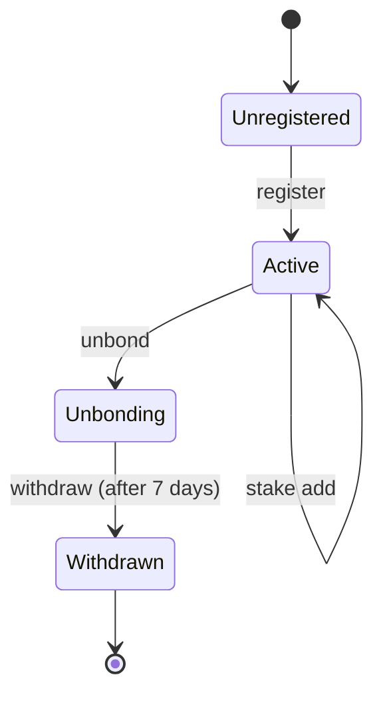

# @reineira-os/operator-cli

Command-line interface for managing Reineira operator operations including registration, staking, bridging, and relaying.

## Installation

```bash
npm install @reineira-os/operator-cli
```

Or run directly with npx:

```bash
npx reineira-operator <command>
```

## Configuration

The CLI can be configured via command-line options or environment variables.

### Environment Variables

Create a `.env` file in your working directory:

```bash
# Destination chain RPC (Arbitrum Sepolia)
RPC_URL=https://arbitrum-sepolia-rpc.publicnode.com

# Source chain RPC (Ethereum Sepolia) - required for bridge command
RPC_URL_SOURCE=https://ethereum-sepolia-rpc.publicnode.com

# Operator wallet private key
PRIVATE_KEY=your_private_key_here

# Contract addresses (Arbitrum Sepolia)
OPERATOR_REGISTRY_ADDRESS=0x5Ac3a3750e0a9f7d4ddBC0B52c3f13E8f927FB59
TASK_EXECUTOR_ADDRESS=0x4D239335f39E585Bb75631C4683538EFC496a5EB
```

### Command-Line Options

| Option                 | Environment Variable        | Description                        |
| ---------------------- | --------------------------- | ---------------------------------- |
| `--rpc <url>`          | `RPC_URL`                   | Destination chain RPC endpoint URL |
| `--rpc-source <url>`   | `RPC_URL_SOURCE`            | Source chain RPC URL (for bridge)  |
| `--private-key <key>`  | `PRIVATE_KEY`               | Operator wallet private key        |
| `--registry <address>` | `OPERATOR_REGISTRY_ADDRESS` | OperatorRegistry contract address  |
| `--executor <address>` | `TASK_EXECUTOR_ADDRESS`     | TaskExecutor contract address      |

## Commands

### register

Register as a new operator with an initial stake.

```bash
reineira-operator register --stake <amount>
```

**Options:**

- `--stake <amount>` (required) - Amount of tokens to stake (minimum 5000 GOV)

**Example:**

```bash
reineira-operator register --stake 5000
```

### status

Display your current operator status including stake and statistics.

```bash
reineira-operator status
```

**Output includes:**

- Registration status
- Active/Inactive/Unbonding status
- Current stake amount
- Unbonding countdown (if applicable)

### stake

Manage your operator stake.

#### stake add

Add more tokens to your existing stake.

```bash
reineira-operator stake add --amount <amount>
```

**Options:**

- `--amount <amount>` (required) - Amount of tokens to add

#### stake info

View stake information including current stake, minimum required, and wallet balance.

```bash
reineira-operator stake info
```

### unbond

Start the unbonding process to exit as an operator. This initiates a 7-day waiting period.

```bash
reineira-operator unbond [--confirm]
```

**Options:**

- `--confirm` - Skip the confirmation prompt

**Notes:**

- You will be immediately removed from active operators
- Stake cannot be withdrawn until the 7-day period completes
- Cannot add stake while unbonding

### withdraw

Withdraw your stake after the unbonding period has completed.

```bash
reineira-operator withdraw
```

**Requirements:**

- Must have initiated unbonding with `unbond` command
- 7-day unbonding period must be complete

### bridge

Bridge USDC from Ethereum Sepolia to Arbitrum Sepolia using Circle's CCTP V2 with escrow hook data.

```bash
reineira-operator bridge --amount <amount> --escrow-id <id> [options]
```

**Options:**

| Option                  | Description                              | Default              |
| ----------------------- | ---------------------------------------- | -------------------- |
| `--amount <amount>`     | Amount of USDC to bridge (e.g., "10.00") | Required             |
| `--escrow-id <id>`      | Escrow ID to include in hook data        | Required             |
| `--recipient <address>` | Recipient address on destination chain   | CCTPV2EscrowReceiver |
| `--fast`                | Use Fast Transfer (~30s)                 | `true`               |
| `--no-fast`             | Use Standard Transfer (~15min)           | -                    |
| `--wait`                | Wait for attestation                     | -                    |

**Examples:**

```bash
# Fast transfer with escrow ID
reineira-operator bridge --amount 10.00 --escrow-id 42 --wait

# Standard transfer (slower, no fee)
reineira-operator bridge --amount 100.00 --escrow-id 123 --no-fast --wait

# Custom recipient
reineira-operator bridge --amount 5.00 --escrow-id 1 --recipient 0x1234...
```

### relay

Relay a CCTP message to the destination chain.

```bash
reineira-operator relay --tx-hash <hash> [options]
```

**Options:**

| Option                | Description                             | Default  |
| --------------------- | --------------------------------------- | -------- |
| `--tx-hash <hash>`    | Source chain transaction hash           | Required |
| `--message <hex>`     | CCTP message (if already fetched)       | -        |
| `--attestation <hex>` | Circle attestation (if already fetched) | -        |
| `--skip-claim`        | Skip claiming the task                  | -        |

**Example:**

```bash
# Relay a transaction (fetches attestation automatically)
reineira-operator relay --tx-hash 0x907e4defd98dd9e202db20fa4242eda19b439856ccd40866be91f2ba5fce375c
```

**Output:**

```
ℹ Operator address: 0xa2293acEC08A6fb0A622b976ed2cF4aF1edEA292
ℹ Fetching attestation for tx 0x907e4...
──────────────────────────────────────────────────
Event Nonce:     0xa808801770d3b62f...
Status:          complete
✓ Attestation received
ℹ Message hash: 0x1234...
ℹ Executing task...
  tx: 0xabc123...
ℹ Waiting for confirmation...
✓ Task executed successfully!

Task Details
──────────────────────────────────────────────────
Transaction:     0xabc123...
Block:           12345678
Gas Used:        250000
Task Type:       CCTP_RELAY
Task Hash:       0x1234...
Operator:        0xa2293acEC08A6fb0A622b976ed2cF4aF1edEA292
Fee Earned:      0.01 USDC
```

## Operator Lifecycle



## Contract Addresses (Arbitrum Sepolia)

| Contract                         | Address                                      |
| -------------------------------- | -------------------------------------------- |
| OperatorRegistry                 | `0x5Ac3a3750e0a9f7d4ddBC0B52c3f13E8f927FB59` |
| TaskExecutor                     | `0x4D239335f39E585Bb75631C4683538EFC496a5EB` |
| FeeManager                       | `0x639f5cB99DcF9681A0461A1452c3845811d3308A` |
| CCTPHandler                      | `0x575186a64B9FC49E135A2440DC4A1395edc0F3aD` |
| Staking Token (GOV)              | `0xb847e041bB3bC78C3CD951286AbCa28593739D12` |
| CCTPV2ConfidentialEscrowReceiver | `0xe0E6CC9Ee62Fa36b96eC4F50CDc462Fd14aa0fD3` |
| ConfidentialEscrow               | `0xF50A9CF008a79CFCA39aa9a345aa06e8D12727E2` |

## CCTP V2 Addresses

### Ethereum Sepolia (Source - Domain 0)

| Contract             | Address                                      |
| -------------------- | -------------------------------------------- |
| USDC                 | `0x1c7D4B196Cb0C7B01d743Fbc6116a902379C7238` |
| TokenMessengerV2     | `0x9f3B8679c73C2Fef8b59B4f3444d4e156fb70AA5` |
| MessageTransmitterV2 | `0x7865fAfC2db2093669d92c0F33AeEF291086BEFD` |

### Arbitrum Sepolia (Destination - Domain 3)

| Contract                         | Address                                      |
| -------------------------------- | -------------------------------------------- |
| USDC                             | `0x75faf114eafb1BDbe2F0316DF893fd58CE46AA4d` |
| TokenMessengerV2                 | `0x9f3B8679c73C2Fef8b59B4f3444d4e156fb70AA5` |
| MessageTransmitterV2             | `0xE737e5cEBEEBa77EFE34D4aa090756590b1CE275` |
| CCTPV2ConfidentialEscrowReceiver | `0xe0E6CC9Ee62Fa36b96eC4F50CDc462Fd14aa0fD3` |

## Economics

| Parameter        | Value      |
| ---------------- | ---------- |
| Minimum Stake    | 5,000 GOV  |
| Unbond Period    | 7 days     |
| Exclusive Window | 60 seconds |
| Protocol Fee     | 0.3%       |
| Operator Fee     | 0.5%       |

## Example Session

```bash
# Check if registered
$ reineira-operator status
Operator Status
═════════════════════════════════════════════
Address:     0xa2293acEC08A6fb0A622b976ed2cF4aF1edEA292
─────────────────────────────────────────────
Registered:  No

Not registered. Run 'register --stake <amount>' to start.
Minimum stake: 5000.0 GOV

# Register with minimum stake
$ reineira-operator register --stake 5000
ℹ Approving tokens...
  tx: 0x21589d41089182a73c3b7feef81d32c990648da6fc23ab7597b4fefa3af5a0cd
ℹ Registering operator...
  tx: 0x28a07c85b7b1014e33abd8710a009552b1f985b47b7d2805d99a125bfa8c2230
✓ Registered as operator with 5000 stake
ℹ Address: 0xa2293acEC08A6fb0A622b976ed2cF4aF1edEA292

# Verify registration
$ reineira-operator status
Operator Status
═════════════════════════════════════════════
Address:     0xa2293acEC08A6fb0A622b976ed2cF4aF1edEA292
─────────────────────────────────────────────
Registered:  Yes
Status:      Active
Stake:       5000.0 GOV
═════════════════════════════════════════════
```

## Development

```bash
# Build
npm run build

# Run locally
node dist/index.js status
```

## License

MIT
