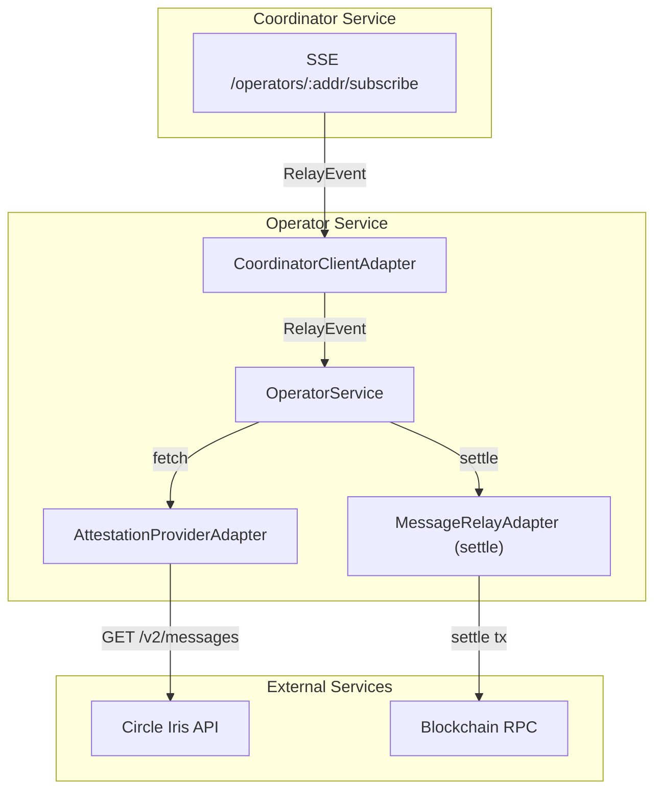
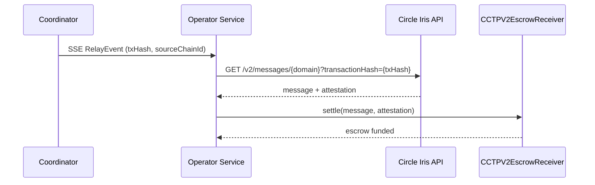
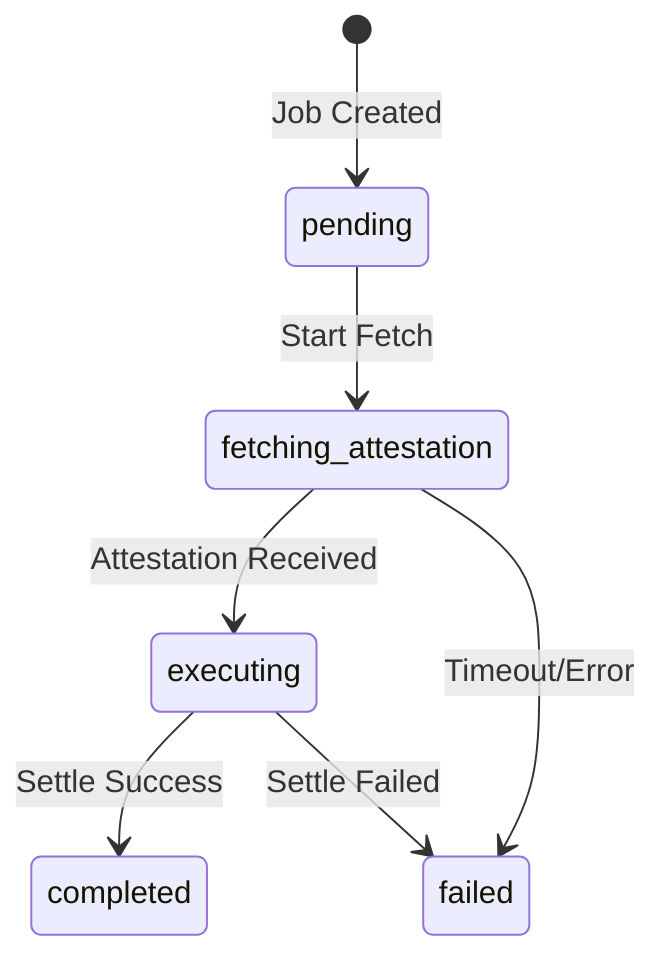

# Reineira Operator Service

Automated operator service for processing CCTP cross-chain messages.

## Overview

The operator service is a **permissionless relayer**:

1. Subscribes to the Coordinator service via SSE (Server-Sent Events)
2. Receives relay job assignments
3. Fetches attestations from Circle's Iris API
4. Calls `CCTPV2EscrowReceiver.settle(message, attestation)` on the destination chain

There is no registration, staking, or task-claim step — the receiver verifies the
Circle attestation on-chain, so anyone can settle a pending message.

## Prerequisites

- Node.js 18+
- A funded wallet for destination-chain gas (no stake required)
- Access to Arbitrum Sepolia RPC

## Setup

1. Copy the environment example:

```bash
cp .env.example .env
```

2. Configure your environment variables:

```env
PRIVATE_KEY=0x...                # Private key for signing settlement txs
COORDINATOR_URL=http://localhost:3001
RPC_URL=https://arbitrum-sepolia-rpc.publicnode.com
ESCROW_RECEIVER_ADDRESS=0xe0E6CC9Ee62Fa36b96eC4F50CDc462Fd14aa0fD3
ESCROW_CHAIN_ID=421614
```

3. Install dependencies:

```bash
npm install
```

4. Build the project:

```bash
npm run build
```

## Running

Start the operator service:

```bash
npm start
```

Or for development:

```bash
npm run start:dev
```

## Architecture



## Message Flow



## Job State Machine



## API Endpoints

The operator exposes a REST API for monitoring. See [openapi.yaml](./openapi.yaml) for the full specification.

| Endpoint           | Method | Description                 |
| ------------------ | ------ | --------------------------- |
| `/status`          | GET    | Get operator service status |
| `/status/jobs`     | GET    | Get job status summary      |
| `/status/jobs/all` | GET    | Get all relay jobs          |
| `/status/jobs/:id` | GET    | Get a specific relay job    |

## Environment Variables

| Variable                  | Description                            | Default                               |
| ------------------------- | -------------------------------------- | ------------------------------------- |
| `PRIVATE_KEY`             | Private key for signing settlement txs | Required                              |
| `COORDINATOR_URL`         | Coordinator service URL                | `http://localhost:3001`               |
| `RPC_URL`                 | Arbitrum Sepolia RPC URL               | Required                              |
| `ESCROW_RECEIVER_ADDRESS` | CCTPV2EscrowReceiver contract address  | Required                              |
| `ESCROW_CHAIN_ID`         | Chain the escrow receiver lives on     | `421614`                              |
| `IRIS_API_URL`            | Circle Iris attestation API            | `https://iris-api-sandbox.circle.com` |
| `POLLING_INTERVAL_MS`     | Attestation polling interval           | `2000`                                |
| `ATTESTATION_TIMEOUT_MS`  | Max wait time for attestation          | `300000`                              |
| `PORT`                    | HTTP server port                       | `3002`                                |

## Manual Relay (CLI)

You can also manually relay messages using the operator-cli:

```bash
# Relay a specific transaction
npx reineira-operator relay --tx-hash 0x907e4defd98dd9e202db20fa4242eda19b439856ccd40866be91f2ba5fce375c
```

This will:

1. Fetch the attestation from Circle's Iris API
2. Call `settle(message, attestation)` on the escrow receiver
3. Display the settled escrow ID and amount

## Development

```bash
# Run tests
npm test

# Run e2e tests
npm run test:e2e

# Run with coverage
npm run test:cov

# Lint
npm run lint

# Format
npm run format
```

## License

MIT
