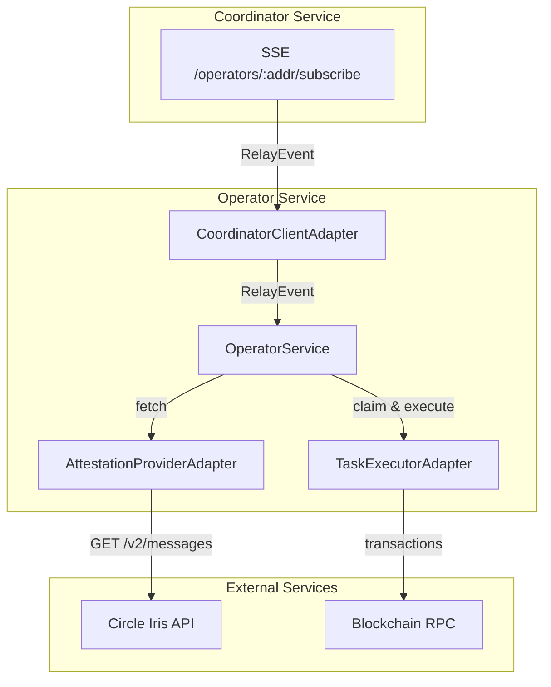
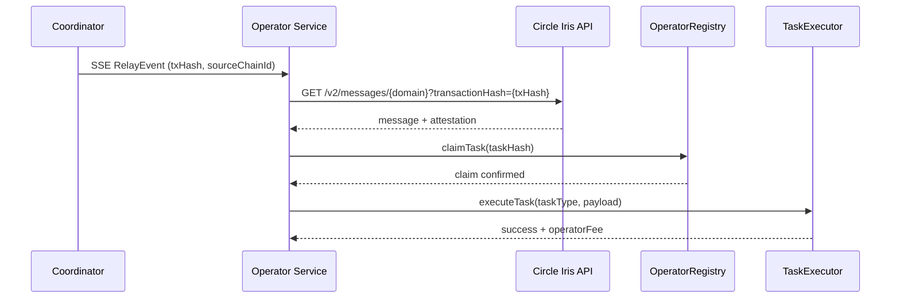
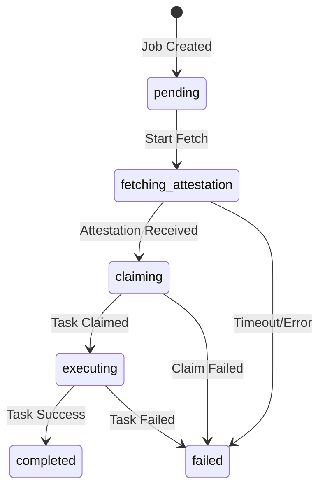

# Reineira Operator Service

Automated operator service for processing CCTP cross-chain messages.

## Overview

The operator service:

1. Subscribes to the Coordinator service via SSE (Server-Sent Events)
2. Receives relay job assignments
3. Fetches attestations from Circle's Iris API
4. Claims tasks in the OperatorRegistry for exclusive execution
5. Executes tasks via the TaskExecutor contract

## Prerequisites

- Node.js 18+
- A registered operator address with staked GOV tokens
- Access to Arbitrum Sepolia RPC

## Setup

1. Copy the environment example:

```bash
cp .env.example .env
```

2. Configure your environment variables:

```env
OPERATOR_ADDRESS=0x...           # Your operator address
PRIVATE_KEY=0x...                # Private key for signing
COORDINATOR_URL=http://localhost:3001
RPC_URL=https://arbitrum-sepolia-rpc.publicnode.com
OPERATOR_REGISTRY_ADDRESS=0x5Ac3a3750e0a9f7d4ddBC0B52c3f13E8f927FB59
TASK_EXECUTOR_ADDRESS=0x4D239335f39E585Bb75631C4683538EFC496a5EB
```

3. Install dependencies:

```bash
npm install
```

4. Build the project:

```bash
npm run build
```

## Running

Start the operator service:

```bash
npm start
```

Or for development:

```bash
npm run start:dev
```

## Architecture



## Message Flow



## Job State Machine



## API Endpoints

The operator exposes a REST API for monitoring. See [openapi.yaml](./openapi.yaml) for the full specification.

| Endpoint           | Method | Description                 |
| ------------------ | ------ | --------------------------- |
| `/status`          | GET    | Get operator service status |
| `/status/jobs`     | GET    | Get job status summary      |
| `/status/jobs/all` | GET    | Get all relay jobs          |
| `/status/jobs/:id` | GET    | Get a specific relay job    |

## Environment Variables

| Variable                    | Description                          | Default                               |
| --------------------------- | ------------------------------------ | ------------------------------------- |
| `OPERATOR_ADDRESS`          | Your operator's Ethereum address     | Required                              |
| `PRIVATE_KEY`               | Private key for signing transactions | Required                              |
| `COORDINATOR_URL`           | Coordinator service URL              | `http://localhost:3001`               |
| `RPC_URL`                   | Arbitrum Sepolia RPC URL             | Required                              |
| `TASK_EXECUTOR_ADDRESS`     | TaskExecutor contract address        | Required                              |
| `OPERATOR_REGISTRY_ADDRESS` | OperatorRegistry contract address    | Required                              |
| `IRIS_API_URL`              | Circle Iris attestation API          | `https://iris-api-sandbox.circle.com` |
| `POLLING_INTERVAL_MS`       | Attestation polling interval         | `2000`                                |
| `ATTESTATION_TIMEOUT_MS`    | Max wait time for attestation        | `300000`                              |
| `PORT`                      | HTTP server port                     | `3002`                                |

## Manual Relay (CLI)

You can also manually relay messages using the operator-cli:

```bash
# Relay a specific transaction
npx reineira-operator relay --tx-hash 0x907e4defd98dd9e202db20fa4242eda19b439856ccd40866be91f2ba5fce375c
```

This will:

1. Fetch the attestation from Circle's Iris API
2. Execute the task on the destination chain
3. Display the result including fees earned

## Development

```bash
# Run tests
npm test

# Run e2e tests
npm run test:e2e

# Run with coverage
npm run test:cov

# Lint
npm run lint

# Format
npm run format
```

## License

MIT
