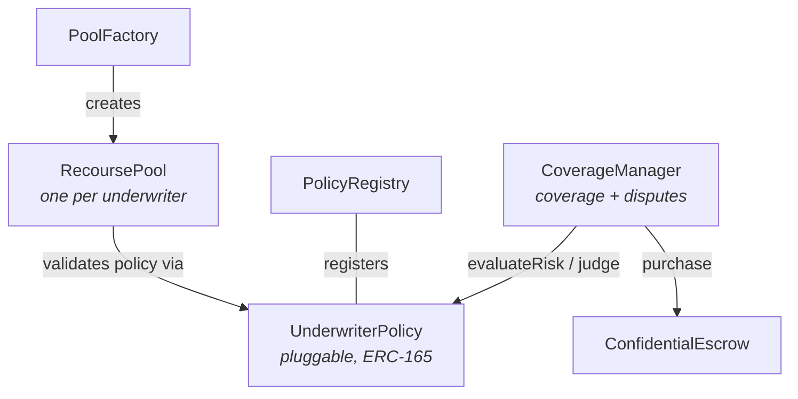

# Reineira Protocol

> **Status: testnet, pre-audit, partial.** This package demonstrates operator-funded recourse
> mechanics. `IUnderwriterPolicy` is pluggable, but only mocks ship; LP rewards are stubbed and the
> capital model is a single flat pool. References to underwriters, premiums, coverage, disputes,
> and claims below are API/domain names, not evidence of a live insurance product, carrier
> capacity, or production underwriting. See
> [`../../docs/IMPLEMENTATION-STATUS.md`](../../docs/IMPLEMENTATION-STATUS.md).

Confidential on-chain recourse protocol built on [Fhenix](https://www.fhenix.io/) (FHE blockchain). All sensitive data — stakes, premiums, coverage amounts, and risk scores — is encrypted end-to-end using Fully Homomorphic Encryption.

## Architecture



### Core Contracts

| Contract            | Role                                                                                               |
| ------------------- | -------------------------------------------------------------------------------------------------- |
| **PoolFactory**     | Central registry. Anyone calls `createPool()` to deploy an RecoursePool and become an underwriter. |
| **PolicyRegistry**  | Registry for validated `IUnderwriterPolicy` contracts. ERC-165 checked on registration.            |
| **RecoursePool**    | Per-underwriter LP pool. LPs stake encrypted amounts, underwriters manage allowed policies.        |
| **CoverageManager** | Orchestrates coverage purchase and dispute resolution against pools and policies.                  |

### Plugins

| Contract              | Role                                                                                                                                       |
| --------------------- | ------------------------------------------------------------------------------------------------------------------------------------------ |
| **UnderwriterPolicy** | Pluggable interface combining risk evaluation (`evaluateRisk`) and dispute resolution (`judge`). Developers deploy custom implementations. |

### External

| Contract               | Role                                                                                |
| ---------------------- | ----------------------------------------------------------------------------------- |
| **ConfidentialEscrow** | Third-party encrypted escrow. CoverageManager attaches premium fees via `setFee()`. |

## Flow

1. **Underwriter** calls `PoolFactory.createPool(paymentToken)` → deploys an `RecoursePool`
2. **Developer** deploys an `IUnderwriterPolicy` implementation → registers via `PolicyRegistry.registerPolicy()`
3. **Underwriter** calls `pool.addPolicy(policy)` to allow the policy on their pool
4. **LPs** call `pool.stake(encryptedAmount)` to provide liquidity
5. **Buyer** calls `CoverageManager.purchaseCoverage(pool, policy, ...)` → policy evaluates risk → premium set as escrow fee
6. **Dispute** via `CoverageManager.dispute(encryptedCoverageId, proof)` → policy judges → pool pays claim if valid

## Privacy Model

- **Encrypted on-chain**: stake amounts, coverage amounts, escrow IDs, risk scores, premiums, dispute results
- **Plain on-chain**: `coverageId`, `stakeId`, `poolId`, `policyId` (sequential identifiers only)
- **Events**: parameterless (except indexed IDs) to prevent data leakage
- **Errors**: parameterless where possible

## Project Structure

```
contracts/
├── common/                     # Shared base contracts
│   └── TestnetCoreBase.sol
├── core/                       # Core protocol contracts
│   ├── PoolFactory.sol
│   ├── PolicyRegistry.sol
│   ├── RecoursePool.sol
│   └── CoverageManager.sol
├── plugins/                    # Standalone pluggable modules
│   └── {Name}Policy.sol
├── interfaces/
│   ├── core/                   # Core interfaces
│   │   ├── ICore.sol
│   │   ├── IPoolFactory.sol
│   │   ├── IPolicyRegistry.sol
│   │   ├── IRecoursePool.sol
│   │   └── ICoverageManager.sol
│   ├── plugins/                # Plugin interfaces
│   │   └── IUnderwriterPolicy.sol
│   └── external/               # Third-party interfaces
│       └── IConfidentialEscrow.sol
└── mocks/                      # Test-only mocks
scripts/deploy/
test/unit/
test/integration/
test/fixtures/
```

## Setup

```bash
npm install
npm run compile
```

## Commands

| Command                 | Description                    |
| ----------------------- | ------------------------------ |
| `npm run compile`       | Compile contracts              |
| `npm test`              | Run tests                      |
| `npm run test:coverage` | Run tests with coverage        |
| `npm run lint`          | Lint TypeScript and Solidity   |
| `npm run format`        | Format all files with Prettier |
| `npm run deploy`        | Deploy to Arbitrum Sepolia     |

## Stack

- Solidity `^0.8.24`
- Foundry (Forge)
- OpenZeppelin Contracts (upgradeable, UUPS)
- Fhenix CoFHE (FHE encrypted types)
- FHERC20 (encrypted ERC-20)

## License

MIT
